# Secure Messaging Platform

> Documentation update in progress
> The application is actively evolving. Some feature descriptions, screenshots,
> endpoints, and architecture details in this README may not yet reflect the
> latest deployed version.

## Project Documentation

- [Current Application State](CURRENT_STATE.md)
- [Changelog](CHANGELOG.md)


## Project Overview


The Secure Messaging Platform is a full-stack cloud-deployed communication application that enables secure user authentication, private messaging, and group messaging through a modern web interface.


I designed and developed the platform using Spring Boot for the backend and React for the frontend. The system implements JWT-based authentication, secure password storage, protected REST APIs, containerized deployment using Docker, and cloud hosting on AWS EC2.


The platform demonstrates full-stack software engineering, cloud deployment, DevOps automation, database management, authentication, authorization, and secure communication workflows.


---


## Table of Contents

- [Project Overview](#project-overview)
- [Table of Contents](#table-of-contents)
- [Key Features](#key-features)
- [System Architecture](#system-architecture)
- [Technology Stack](#technology-stack)
- [Project Structure](#project-structure)
- [Database Design](#database-design)
- [Security Features](#security-features)
- [Encryption Features](#encryption-features)
- [Welcome Page](#welcome-page)
- [Authentication Workflow](#authentication-workflow)
- [Messaging Features](#messaging-features)
- [Group Messaging](#group-messaging)
    - [Group Creation and Private Membership](#group-creation-and-private-membership)
    - [Invitations for Registered and Unregistered Users](#invitations-for-registered-and-unregistered-users)
    - [Group Roles and Administration](#group-roles-and-administration)
    - [Encrypted Group Attachments](#encrypted-group-attachments)
    - [Group Message Search](#group-message-search)
    - [Group Message Actions](#group-message-actions)
    - [Seen Status and Message Metadata](#seen-status-and-message-metadata)
    - [Real-Time Group Updates](#real-time-group-updates)
    - [Group Decision Governance](#group-decision-governance)
        - [Owner Review Governance](#owner-review-governance)
        - [Member Vote Governance](#member-vote-governance)
        - [Owner Led Governance](#owner-led-governance)
        - [Append-Only Governance Audit Trail](#append-only-governance-audit-trail)
            - [Decision Acknowledgment Workflow](#decision-acknowledgment-workflow)
    - [Group Messaging Screenshots](#group-messaging-screenshots)
- [Deployment Architecture](#deployment-architecture)
- [Monitoring and Logging](#monitoring-and-logging)
- [CI/CD Pipeline](#cicd-pipeline)
- [Diagrams](#diagrams)
- [Key Contributions](#key-contributions)
- [Future Improvements](#future-improvements)
    - [Group Conversation Awareness](#group-conversation-awareness)
    - [Governance Audit Administration](#governance-audit-administration)
    - [Password and Authentication Management](#password-and-authentication-management)
    - [Messaging and Notification Improvements](#messaging-and-notification-improvements)
    - [AI-Powered Intelligence](#ai-powered-intelligence)
    - [User Experience Improvements](#user-experience-improvements)
    - [Scalability Improvements](#scalability-improvements)
    - [Security Enhancements](#security-enhancements)
- [Learning Outcomes](#learning-outcomes)
- [Final Conclusion](#final-conclusion)
- [Author](#author)

---


## Key Features


- User registration and login

- JSON Web Token (JWT)-based authentication and authorization

- Secure password storage with BCrypt

- Password policy enforcement and compromised-password screening

- Authenticated Change Password workflow

- Private messaging between registered users

- Direct message attachment upload and download

- Inbox unread message tracking

- Group creation, joining, membership display, and group chat

- Real-time group chat with WebSocket/STOMP support and REST polling fallback

- PostgreSQL database persistence

- Spring Security integration

- RESTful API architecture

- Docker containerization

- AWS EC2 production deployment

- Nginx reverse proxy configuration

- HTTPS/SSL support

- GitHub Actions CI/CD automation

- Monitoring and backend logging

---


## System Architecture


The Secure Messaging Platform follows a modern three-tier architecture consisting of a React frontend, a Spring Boot backend, and a PostgreSQL database.

The frontend provides the user interface for authentication, private messaging, and group communication. Incoming user requests are routed through Nginx and forwarded to the appropriate application components. Spring Security and JWT authentication protect secured endpoints, while Hibernate/JPA manages database persistence and data access operations.

The Secure Messaging Platform is deployed on an AWS EC2 production server using Docker Compose. Incoming HTTPS requests are handled by Nginx, which serves the React frontend and routes API requests to the Spring Boot backend. The backend exposes REST APIs, enforces authentication and authorization through Spring Security and JWT tokens, and persists application data in a PostgreSQL database.

This architecture provides a clear separation of concerns between the presentation layer (React), application layer (Spring Boot), and data layer (PostgreSQL), resulting in a scalable, maintainable, and production-ready full-stack application.

---

## Technology Stack


### Backend


- Java 17

- Spring Boot

- Spring Security

- Hibernate / JPA

- JWT Authentication

- Maven


### Frontend


- React

- Vite

- React Router
  
- Axios

- JavaScript

- HTML5

- CSS3


### Database


- PostgreSQL


### DevOps & Cloud


- Docker

- Docker Compose

- AWS EC2

- Nginx

- GitHub Actions

- HTTPS / SSL


---


## Project Structure


```text
secure-messaging-platform/
├─ secure-messaging-backend/
├─ secure-messaging-frontend/
├─ screenshots/
├─ diagrams/
├─ docker-compose.yml
└─ README.md
```

---


## Database Design

### Database Design Diagram

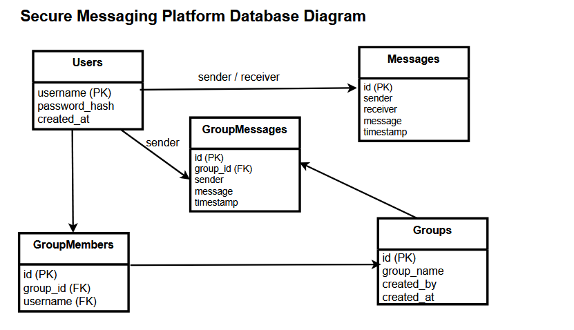


Illustrates the relational database structure used by the platform, including users, messages, groups, group memberships, and group messages.


---


## Security Features


The Secure Messaging Platform implements multiple layers of security to protect user accounts, application resources, and communication workflows.


### JSON Web Token (JWT) Authentication


- Authenticates users after successful login

- Issues a JWT token for protected requests

- Requires valid tokens for secured API access

- Prevents unauthorized users from accessing private messaging features


### Spring Security


- Protects backend REST endpoints

- Separates public routes from protected routes

- Allows public access to registration and login

- Requires authentication for messaging, dashboard, and group communication features


### Password Protection


- Stores new passwords using BCrypt with strength 12

- Avoids storing plain-text passwords

- Requires new passwords to contain at least 15 Unicode characters

- Limits passwords to 72 UTF-8 bytes to remain within BCrypt's supported input size

- Allows passphrases and spaces without forcing predictable character-composition rules

- Screens registration and changed passwords against a local common-password blocklist

- Rejects predictable passwords based on the username, email, and application name

- Checks passwords against the Have I Been Pwned Pwned Passwords range service without transmitting the plaintext password or complete hash

- Requires verification of the current password before an authenticated password change

- Clears the frontend authentication state and requires a new login after a successful password change

- Temporarily supports legacy SHA-256 accounts and migrates them to BCrypt after successful authentication


### Protected REST APIs


- Validates authentication before processing sensitive requests

- Rejects unauthorized API calls

- Protects user messages, inbox data, and group messaging endpoints


### Secure Deployment


- Uses Nginx as a reverse proxy

- Supports HTTPS/SSL in production

- Runs services inside Docker containers

- Deploys the application on AWS EC2


---

## Encryption Features

The Secure Messaging Platform includes encryption-focused features that demonstrate secure communication workflows and protected message storage.

### Encrypted Message Transmission

Messages can be encrypted before being transmitted between users, helping protect message content during communication.

### Encrypted Storage Concepts

Encrypted message handling was explored during development to demonstrate how sensitive communication data can be protected within application workflows.

### Encryption Workflow

1. User composes a message.
2. Message content is encrypted.
3. Encrypted data is transmitted or stored.
4. Authorized users retrieve the message.
5. Message content is decrypted for viewing.

### Encryption Screenshots

#### Encrypted Send Message

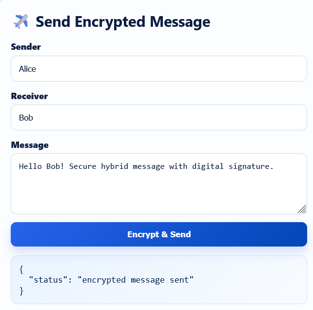

Demonstrates message encryption before transmission, illustrating how message content can be protected prior to delivery.

#### Decrypted Inbox View

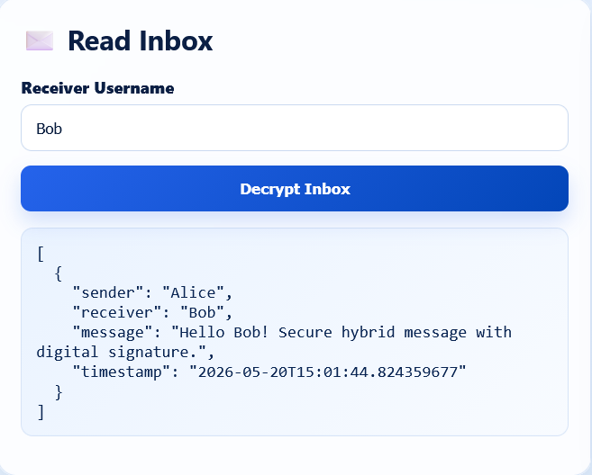

Shows successful message decryption within the inbox interface, allowing authorized users to view protected message content.

#### Encrypted Repository View

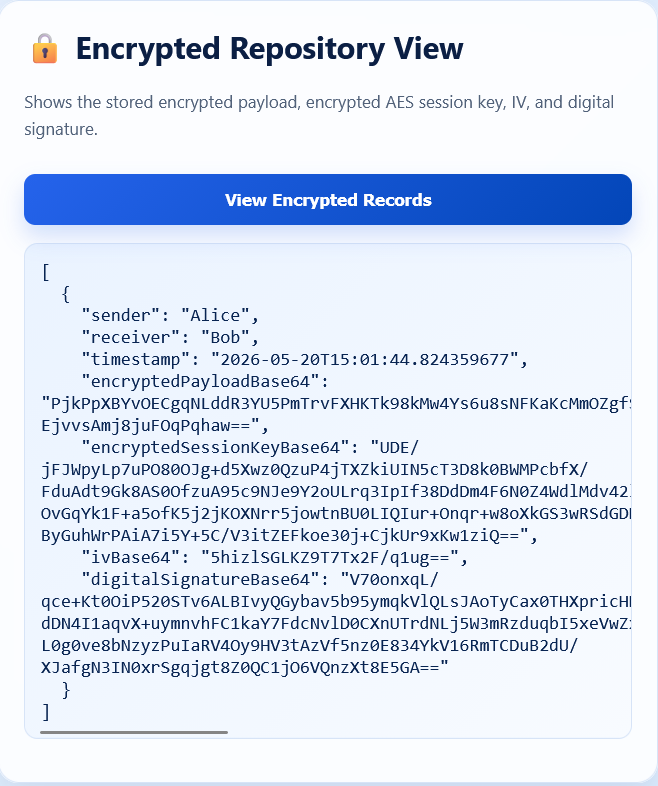

Illustrates encrypted message persistence and storage concepts explored during development to support secure communication workflows.

---
## Welcome Page

The Secure Messaging Platform begins with a dedicated Welcome Page that serves as the public entry point to the application. The landing experience introduces the platform, highlights key features, and provides convenient access to registration and login workflows.

### Welcome Screen

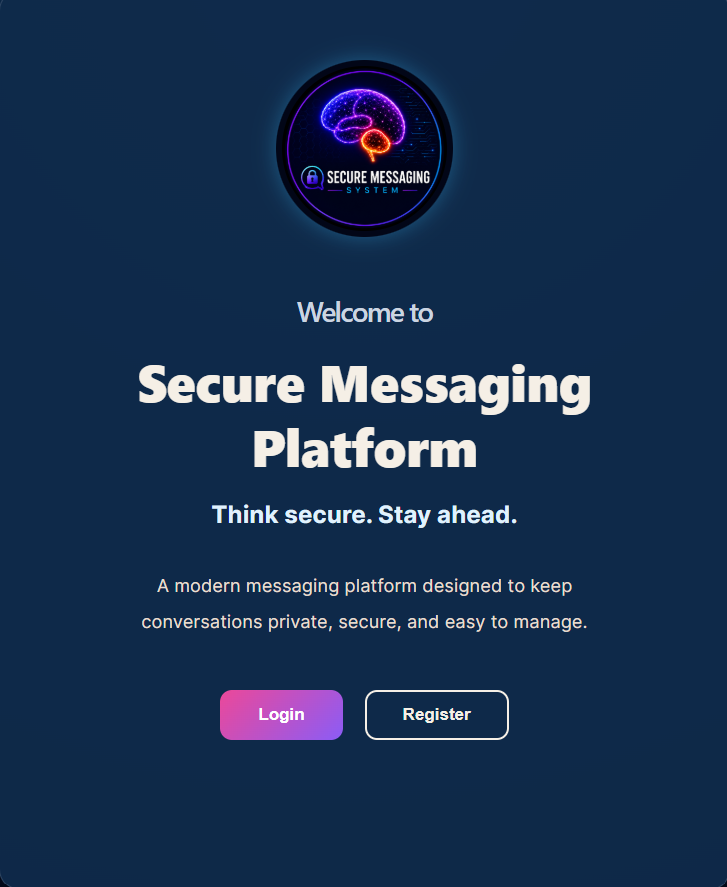

The Welcome Page presents the Secure Messaging Platform branding, project overview, feature highlights, and navigation options that guide users into the secure messaging environment. This enhancement improves usability, strengthens application branding, and creates a more professional user experience before authentication.

---


## Authentication Workflow


The authentication workflow controls how users register, log in, and access protected features inside the Secure Messaging Platform.


### Registration


- A new user creates an account through the registration page.

- The registration interface requires password confirmation.

- The backend validates the password length, BCrypt byte limit, local blocklist, and context-specific predictable values.

- The backend checks the password against the Have I Been Pwned Pwned Passwords range service using the k-anonymity range workflow.

- Only the first five characters of a locally generated SHA-1 hash are transmitted for compromised-password screening.

- The plaintext password and complete password hash remain within the backend.

- The password is hashed using BCrypt with strength 12 before being stored.

- User information is persisted in the PostgreSQL database.


### Login


- A registered user submits a username and password.

- The backend normalizes username whitespace before authentication and JWT creation.

- The backend verifies BCrypt passwords and temporarily supports legacy SHA-256 hashes.

- A successful legacy login automatically migrates the stored password hash to BCrypt.

- Five failed attempts for a normalized username trigger a temporary 15-minute login block.

- Invalid credentials and temporary blocking use a generic browser message that does not reveal whether an account exists.

- Public login failures do not trigger the authenticated expired-session workflow.

- If authentication succeeds, the backend generates a JWT token.

- The frontend stores the token and uses it for future protected API requests.


### Change Password


- Authenticated users can open the Change Password page from the dashboard.

- The user must provide the correct current password.

- The new password must satisfy the same length, BCrypt byte-limit, local-screening, and compromised-password requirements used during registration.

- After a successful password change, the frontend removes the existing authentication state and redirects the user to Login.

- The previous password no longer authenticates, and the new password can be used for the next login.


### Protected Access


- The user can access secured pages such as the dashboard, private messaging, inbox, and group messaging.

- Each protected request includes the JWT token.

- Spring Security validates the token before allowing access to backend resources.


### Authentication Screenshots

#### Register Page

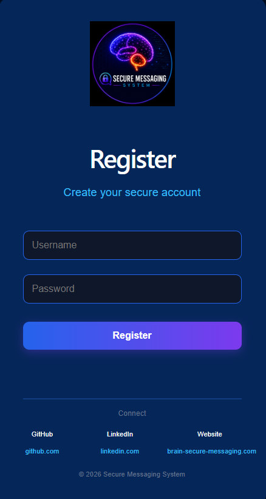

Displays the user registration interface used to create new platform accounts.

#### Login Page

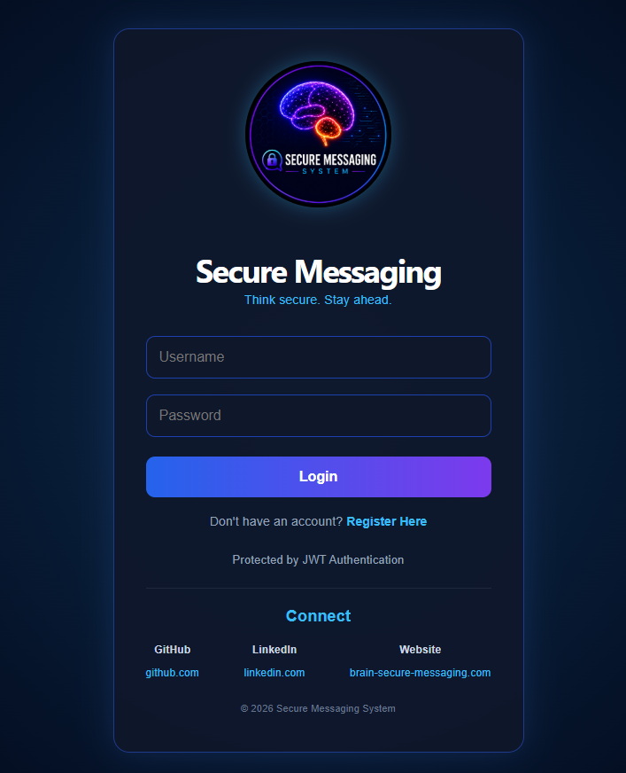

Shows the secure login interface where users authenticate using their registered credentials.

#### Authenticated Dashboard

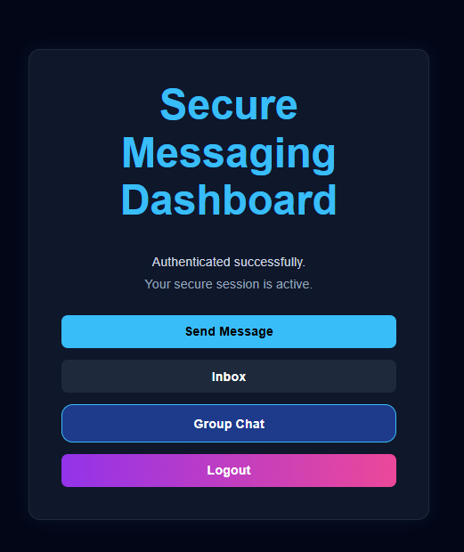

Illustrates successful authentication, confirming that the user's secure session is active and protected application features are accessible.

#### Dashboard Overview

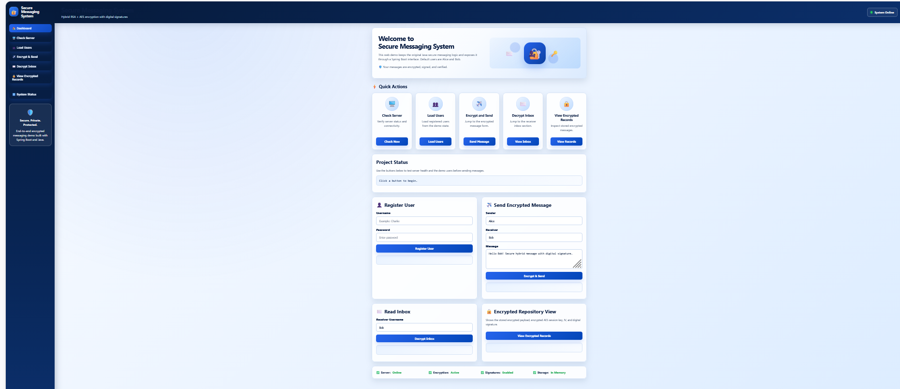

Displays an earlier authenticated dashboard implementation used during development, highlighting navigation options and the evolution of the user interface prior to the final production design.

---


## Messaging Features

The Secure Messaging Platform enables authenticated users to exchange private messages through a secure and user-friendly interface. Private messaging is protected by JWT-authenticated API requests and integrated with the backend message persistence layer.

### Secure Message Delivery

Users can compose and send private messages to other registered users through the messaging interface. Messages are transmitted through protected REST API endpoints secured with JWT authentication.

### Attachment Upload and Download

The platform supports direct message attachments. Users can send a message with an attached file, and the receiver can view the attachment metadata from the inbox and download the file from the frontend interface.

### Inbox Management

Incoming messages are displayed in the user's inbox, allowing users to review received communications in a centralized location. The inbox displays sender information, message content, timestamps, unread status, and attachment download controls when a file is included.

### Unread Message Tracking

The inbox includes unread message tracking to help users identify new messages that require attention. Message cards display unread indicators, and the inbox summary shows unread and attention counts.

### Messaging Screenshots

#### Send Message with Attachment

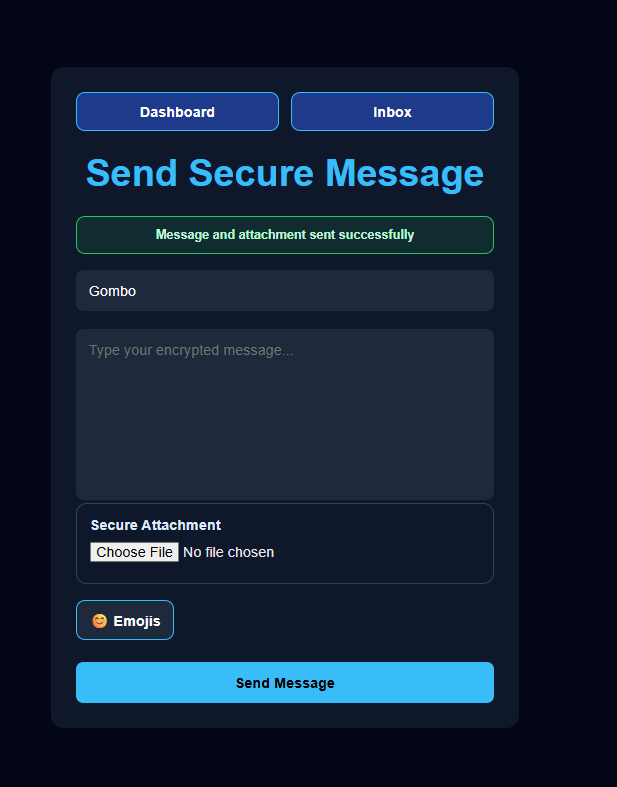

Shows a secure direct message being sent with an attachment and a success confirmation.

#### Inbox Attachment Download

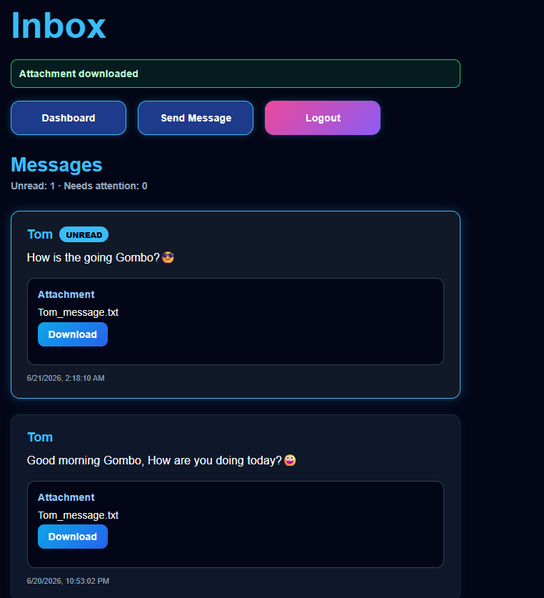

Shows a received direct message with attachment metadata, unread status, and a successful attachment download confirmation.


---

## Group Messaging

The Secure Messaging Platform includes private group conversations for authenticated users. The group workflow supports invitation-based membership, role-based administration, encrypted attachments, searchable message history, message actions, seen counts, persisted decision governance, and real-time conversation updates.

### Group Creation and Private Membership

Authenticated users can create private groups by entering a group name. The user who creates the group becomes its `Owner`.

Groups are invitation-only. The earlier direct-join workflow using a group ID is disabled and no longer creates memberships.

A user becomes a group member only after accepting a valid invitation.

### Invitations for Registered and Unregistered Users

Group owners and administrators can invite participants through two separate workflows:

- Registered users are invited directly by username.
- Unregistered users receive an email registration invitation.

Registered users can review pending group invitations and either accept or decline them.

After an invitation is accepted, the group appears in the user's **My Groups** section.

The invitation workflow prevents invalid cases such as:

- Inviting the current user
- Inviting a user who is already a member
- Creating duplicate pending invitations
- Inviting a nonexistent username through the registered-user workflow

### Group Roles and Administration

Group participation uses three roles:

- `Owner`
- `Admin`
- `Member`

The group owner has the highest level of administrative control.

The owner can:

- Promote eligible members to administrators
- Demote administrators
- Remove eligible members
- Invite registered and unregistered users
- Manage the group

Administrators can invite users and remove eligible regular members. The group owner cannot be removed.

The interface displays role labels so that participants can distinguish the owner, administrators, and regular members.

### Group Membership Display

The selected group displays its current members using compact member badges.

Each member entry includes the username and the assigned role. Administrative controls appear only when the current user's role permits the corresponding action.

### Group Conversation Experience

The Group Chat interface uses a two-page workflow:

1. The group-management page displays group creation, pending invitations, and **My Groups**.
2. Selecting a group opens its conversation page.
3. Users can return to the group-management page with **Back to Groups**.
4. Eligible users can leave the selected group.
5. The group owner can manage the group according to the available owner controls.

Messages are displayed in a chat-style layout with sender labels, timestamps, date separators, and separate alignment for the current user's messages.

The message composer supports:

- Sending with the **Send** button
- Sending with `Enter`
- Adding a new line with `Shift+Enter`
- Emoji insertion
- Optional file attachment selection

### Encrypted Group Attachments

Group members can send encrypted file attachments inside group conversations.

The attachment workflow supports:

- Uploading an attachment with a group message
- Sending an attachment-only message
- Sending a text caption with an attachment
- Displaying attachment name and file size
- Downloading an attachment from the conversation
- Restricting attachment access to group members

The backend encrypts the attachment and stores a separately encrypted attachment key for each eligible group member. A user must have a valid encrypted key before the attachment can be decrypted and downloaded.

Messages containing attachments cannot currently be edited or deleted.

### Group Message Search

Users can search the selected group conversation.

Search matching includes:

- Sender username
- Message text
- Formatted timestamp
- Message date
- Attachment filename

Clearing the search restores the complete conversation history.

### Group Message Actions

Group messages use a compact actions interface instead of displaying permanent action buttons inside every message bubble.

A small `⋯` hint appears when a message is hovered, focused, or opened. Selecting the message displays the available actions.

The message bubble also supports keyboard activation with `Enter` or `Space`.

Available actions include:

- Pin or unpin a message
- Edit the current user's own text-only message
- Delete the current user's own text-only message

Authorization is enforced by both the frontend and backend.

### Pinned and Edited Messages

Pinned messages display the username of the member who pinned them.

Edited messages display an `edited` indicator beside their seen-status metadata.

The edit workflow uses an inline text area with Save and Cancel controls. Attachment messages remain protected from editing.

### Seen Status and Message Metadata

Group messages display a seen count using the current group membership total.

Example:

`Seen by 1 of 7`

Edited messages display both the seen count and edited status:

`Seen by 1 of 7 · edited`

The message-actions hint and seen-status text share a responsive metadata row. This prevents overlap and keeps normal, edited, pinned, short, and long messages aligned consistently.

The **My Groups** list displays unread-count badges so users can identify groups with messages they have not yet viewed.

### Real-Time Group Updates

Group conversations use Spring WebSocket/STOMP on the backend and a SockJS/STOMP client in React.

When group activity occurs, the backend publishes a notification to the selected group topic. The frontend then reloads the latest messages, attachments, and member data.

Real-time notifications support events such as:

- New group messages
- Edited messages
- Deleted messages
- Pinned or unpinned messages
- Membership changes
- Group changes
- Group decision creation
- Group decision approval and rejection
- Group-scoped typing activity

Group members can see when another member is typing in the selected group. The indicator disappears after typing stops, the draft is cleared, the message is sent, or the user leaves the conversation.

Authenticated users send an application-wide presence heartbeat every 10 seconds. A user is considered offline after approximately 30 seconds without a heartbeat, while the selected group refreshes member presence approximately every 3 seconds.

Periodic REST polling remains available as a fallback when the WebSocket connection is unavailable.

### Group Decision Governance

The Secure Messaging Platform includes a persisted group decision-governance subsystem that allows eligible text messages to become structured organizational decisions.

Each decision preserves its source group, source message, source sender, decision-text snapshot, creator, governance mode, current status, and creation time.

The platform supports three completed governance modes:

1. **Owner Review**
2. **Member Vote**
3. **Owner Led**

Each governance mode defines who may initiate the decision, who has authority to resolve it, and how the final result is recorded.

| Governance mode | Decision initiator | Resolution authority |
|---|---|---|
| `OWNER_REVIEW` | Eligible group member | Group owner |
| `MEMBER_VOTE` | Eligible group member | Member ballot outcome, with owner-controlled voting administration |
| `OWNER_LED` | Group owner | Group owner |

#### Owner Review Governance

Owner Review allows an eligible group member to submit a proposal that requires a final decision from the group owner.

- Any eligible group member can create an Owner Review decision from a text message.
- A new Owner Review decision begins with the `PROPOSED` status.
- Only the group owner can approve or reject the unresolved proposal.
- Approval changes the status to `APPROVED`.
- Rejection changes the status to `REJECTED`.
- Owner Approve and Reject controls remain compacted behind `Decision actions` until needed.
- All group members can see the governance mode and current decision status.
- Approved and rejected outcomes remain persisted after page refresh.
- Non-owner members cannot access the owner-only resolution controls.

#### Member Vote Governance

Member Vote provides a structured secret-ballot workflow for decisions resolved through eligible group-member participation.

- Any eligible group member can create a Member Vote decision from a text message.
- The decision begins with the `PROPOSED` status.
- Only the group owner can configure the voting deadline and open voting.
- Voting setup controls remain compacted behind `Decision actions`.
- Eligible members can cast a secret ballot for Approve, Reject, or Abstain.
- Secret-ballot controls remain directly available while voting is open.
- A member may replace an existing ballot while voting remains open.
- Only the member's latest ballot is counted.
- The interface confirms that a ballot was recorded without revealing the selected choice.
- Individual ballot choices are not displayed in the ordinary group interface.
- Voting cannot be resolved before the configured deadline.
- After the deadline, the owner can resolve voting through `Decision actions`.
- Resolution applies deterministic quorum and vote-total rules.
- A tied result enters the `WAITING_FOR_TIE_BREAK` status.
- The group owner can cast a public deciding vote for Approve or Reject.
- Tie-break controls remain compacted behind `Decision actions`.
- The final result is persisted as `APPROVED` or `REJECTED`.

Secret ballots support organizational decision-making through aggregate participation and vote totals while preventing ordinary users from connecting individual members to their voting choices.

#### Owner Led Governance

Owner Led is the third completed governance decision subsystem of the Secure Messaging Platform.

Unlike Owner Review, it does not begin with a proposal submitted by another member. Unlike Member Vote, its resolution does not depend on a member ballot. The group owner initiates the decision and retains final resolution authority.

The Owner Led lifecycle is:

```text
Owner creates decision
        ↓
Discussion Open
        ↓
Owner selects a final action
        ↓
Approved / Rejected / Withdrawn
```

The implemented Owner Led workflow includes the following behavior:

- Only the group owner can create an Owner Led decision.
- The decision is created from an eligible text group message.
- A new Owner Led decision begins with the `DISCUSSION_OPEN` status.
- The source message remains visible as the decision record.
- The owner opens the compact `Owner decision actions` control when ready to resolve the decision.
- The available actions are Approve, Reject, and Withdraw.
- Approve changes the final status to `APPROVED`.
- Reject changes the final status to `REJECTED`.
- Withdraw changes the final status to `WITHDRAWN`.
- Selecting a terminal outcome closes and removes the owner action controls.
- A resolved decision cannot be approved, rejected, or withdrawn again through the normal interface.
- The decision message remains visible after resolution.
- The final outcome persists after browser refresh.
- Other group members can see the governance mode and final outcome.
- Non-owner members cannot access the owner-only decision controls.
- Decision creation and final resolution are synchronized with connected group members through dedicated WebSocket events.

The Approved, Rejected, and Withdrawn Owner Led outcomes have been verified through browser testing with both owner and non-owner group-member accounts.

Decision creation and resolution across all three governance modes are persisted in PostgreSQL and synchronized through dedicated group WebSocket events. Connected group members receive proposal, voting, tie-break, discussion, withdrawal, and final-status updates without requiring a browser refresh.

#### Append-Only Governance Audit Trail

The Secure Messaging Platform maintains a persisted, append-only governance audit trail across all three governance modes. Each governance action is stored as a separate event in the `group_decision_events` table instead of replacing earlier events in the normal decision workflow.

This chronological history provides a durable record of how each decision progresses from creation through discussion, voting, resolution, and acknowledgment. Every event preserves the related decision, group, acting username, event type, event timestamp, and descriptive event details.

The audit trail records the following governance event types:

| Event type | Recorded governance activity |
|---|---|
| `CREATED` | A structured decision was created from an eligible group message. |
| `DISCUSSION_OPENED` | An Owner Led decision entered its member-discussion stage. |
| `VOTING_OPENED` | The group owner configured and opened Member Vote participation. |
| `VOTE_CAST` | An eligible member submitted an initial secret ballot. |
| `VOTE_CHANGED` | A member replaced a previous ballot while voting remained open. |
| `TIE_BREAK_REQUIRED` | Member Vote resolution produced a tie requiring the owner's deciding vote. |
| `QUORUM_NOT_MET` | The required Member Vote participation threshold was not satisfied. |
| `APPROVED` | A decision reached an approved final outcome. |
| `REJECTED` | A decision reached a rejected final outcome. |
| `WITHDRAWN` | The group owner withdrew an Owner Led decision. |
| `ACKNOWLEDGED` | A group member individually acknowledged a finalized decision outcome. |

Because each activity is appended as a new event, later governance actions do not erase the earlier history. The audit trail supports accountability, chronological review, troubleshooting, and future authorized reporting and administrative-review capabilities.

Secret-ballot privacy remains separate from ordinary audit presentation. The platform records that Member Vote activity occurred without exposing individual ballot choices through the normal group interface.

##### Decision Acknowledgment Workflow

After a decision reaches the final `APPROVED`, `REJECTED`, or `WITHDRAWN` status, eligible group members can individually acknowledge that they have seen the outcome.

The implemented acknowledgment workflow includes the following behavior:

- Acknowledgment is available only for finalized decisions.
- Each group member acknowledges the outcome individually.
- Acknowledging a decision does not change its final status.
- The interface displays acknowledgment progress as `Acknowledged by x of y`.
- After the current user acknowledges the decision, the action changes to the non-actionable `Acknowledged` state.
- The acknowledgment state and total remain persisted after browser refresh.
- A unique decision-and-username rule prevents the same member from acknowledging the same decision more than once.
- Each acknowledgment preserves the acknowledging username and acknowledgment timestamp.
- Connected group members receive a `GROUP_DECISION_ACKNOWLEDGED` WebSocket update.
- Every successful acknowledgment appends an `ACKNOWLEDGED` event to `group_decision_events`.

The database event-type constraint is version-controlled through Flyway migration `V1__allow_acknowledged_group_decision_events.sql`. The migration adds `ACKNOWLEDGED` to the permitted governance event types while retaining all previously supported event values.

Production testing verified this persisted decision-event sequence:

```text
CREATED
  ->
APPROVED
  ->
ACKNOWLEDGED
```

Browser testing confirmed the acknowledgment state and displayed total. PostgreSQL verification confirmed the corresponding `ACKNOWLEDGED` event and confirmed that no duplicate acknowledgment existed for the same decision and username.

### Responsive Layout

The Group Chat interface is designed for laptop and monitor screens.

The layout includes:

- Internal scrolling for the conversation history
- A visible message composer
- Compact group and member controls
- Responsive message metadata
- Message bubbles that adapt to short and long content
- Separate alignment for sent and received messages

### Database Management

Group data is persisted with Hibernate/JPA and PostgreSQL.

The group messaging workflow uses stored records for:

- Groups
- Group memberships
- Registered-user invitations
- Email invitations
- Group messages
- Group message read records
- Persisted group decision records
- Attachments
- Group attachment encryption keys

Deleting a group also removes its related messages, read records, invitations, memberships, attachments, and group attachment keys.

### Group Messaging Screenshots

The screenshots below include updated views of the invitation and active-conversation workflows together with selected earlier development milestones. Milestone images are labeled accordingly and may contain controls or visual indicators that were later replaced or refined.

#### Group Management and Invitation Workflow

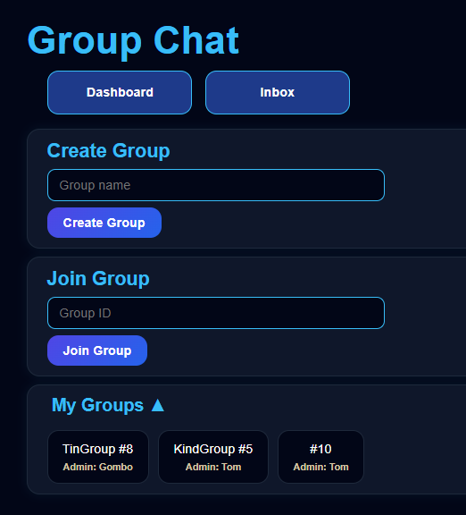

Shows the invitation-based group-management workflow, including group creation, pending invitations, invitation details, Accept and Decline actions, and the **My Groups** section. Direct group joining by group ID is no longer part of the interface.

#### Active Group Conversation

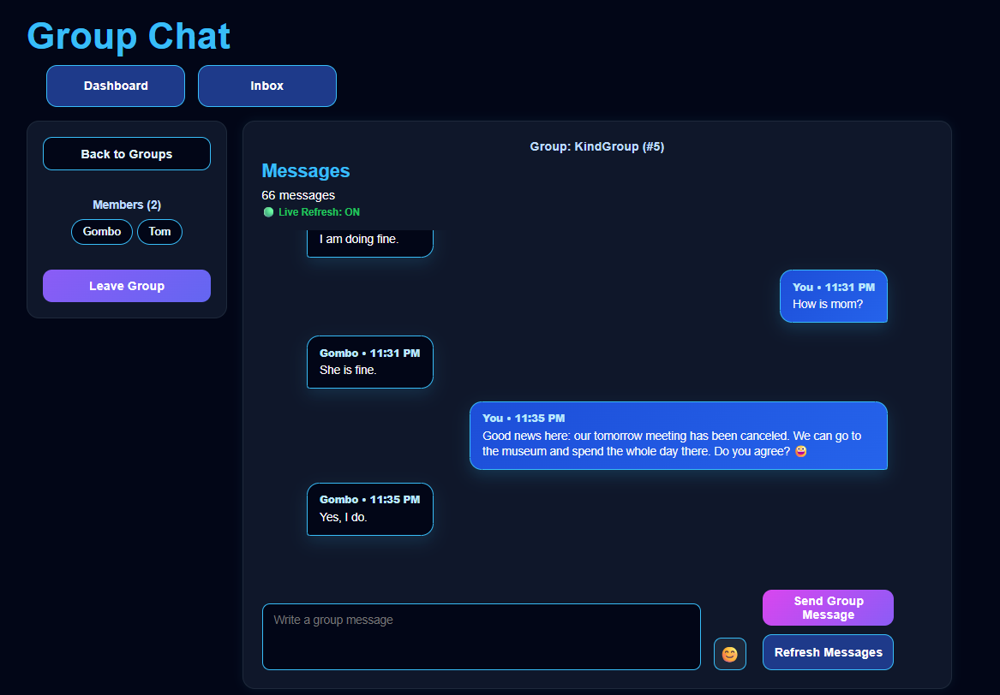

Shows the active group conversation with registered-user and email invitation controls, role-based member administration, message search, message actions, seen and edited metadata, attachment selection, and the group message composer.

#### Two-User Group Chat and Autoscroll Milestone

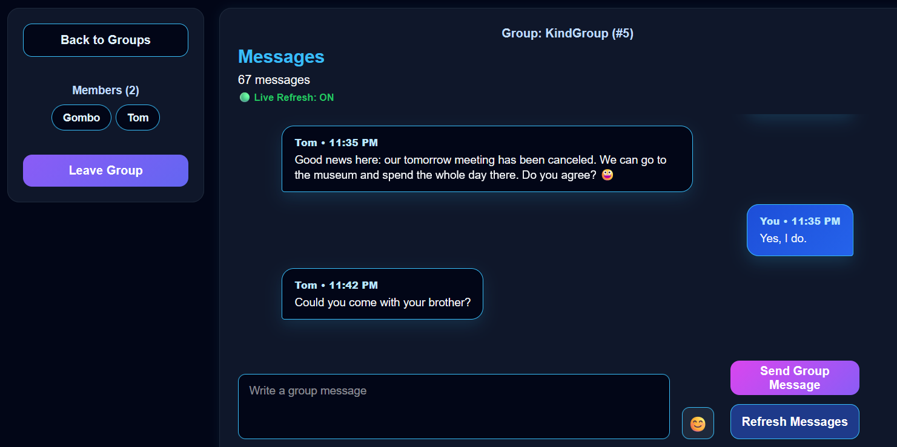

Documents a two-user conversation test used to verify message exchange, responsive layout, and autoscroll behavior.

#### Real-Time Group Chat Milestone

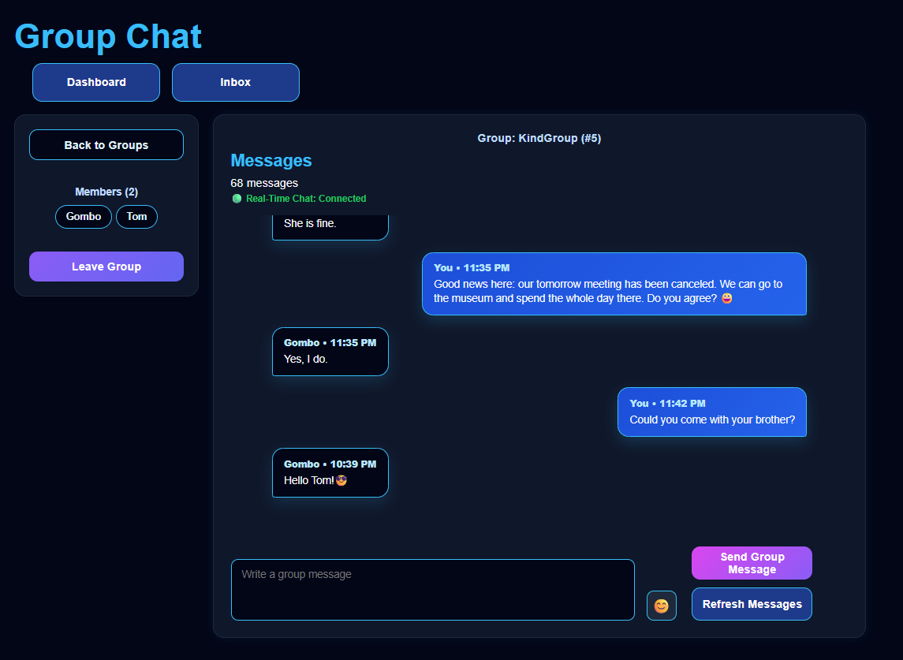

Documents the WebSocket connectivity milestone that introduced real-time group update notifications. The earlier green connection indicator shown in the screenshot is no longer treated as the final interface design.

---


## Deployment Architecture


The Secure Messaging Platform was designed using a containerized deployment architecture that supports local development, cloud hosting, automated deployments, and production scalability.


### Containerized Infrastructure


The application is packaged and deployed using Docker containers. Containerization provides a consistent runtime environment across development, testing, and production systems while simplifying deployment and maintenance.


### Docker Compose Orchestration


Docker Compose is used to manage and coordinate the application's services, including the Spring Boot backend and supporting infrastructure. This approach simplifies multi-service deployment and environment management.


### Cloud Deployment


The platform evolved through multiple deployment stages, beginning with local Docker deployments and cloud-hosted environments before reaching a production-ready AWS EC2 deployment.


### AWS EC2 Hosting


The production environment is hosted on AWS EC2, providing a reliable cloud infrastructure capable of supporting secure communication services. EC2 enables full control over deployment configuration, networking, and application management.


### Nginx Reverse Proxy


Nginx serves as a reverse proxy between users and the application services. Incoming HTTPS requests are routed through Nginx, which forwards frontend traffic to the React service, API traffic to the Spring Boot backend, and WebSocket traffic through the `/ws/` route for real-time group chat support.


### HTTPS and Domain Configuration


The platform supports HTTPS-secured communication, ensuring that data exchanged between users and the application is encrypted during transmission. HTTPS configuration improves security and aligns with modern web deployment standards.


### Deployment Workflow

1. Develop and test application changes locally.
2. Review the Git diff and validate the affected components.
3. Commit the completed changes to the local `main` branch.
4. Temporarily allow GitHub-hosted runner access to EC2 through SSH port 22.
5. Push the commit to `origin/main`.
6. GitHub Actions connects to EC2 using SSH.
7. EC2 fetches `origin/main`, checks out `main`, and resets the working tree to the latest remote commit.
8. Docker Compose rebuilds the application images without deleting the PostgreSQL data volume.
9. Docker Compose force-recreates the application containers.
10. The workflow prints the Docker Compose service status and deployed Git commit for verification.
11. After successful deployment verification, SSH port 22 is returned to the administrator's `My IP` rule.
12. Nginx serves the application over HTTPS at `https://brain-secure-messaging.com`.

### Deployment Screenshots

#### Docker Local Deployment

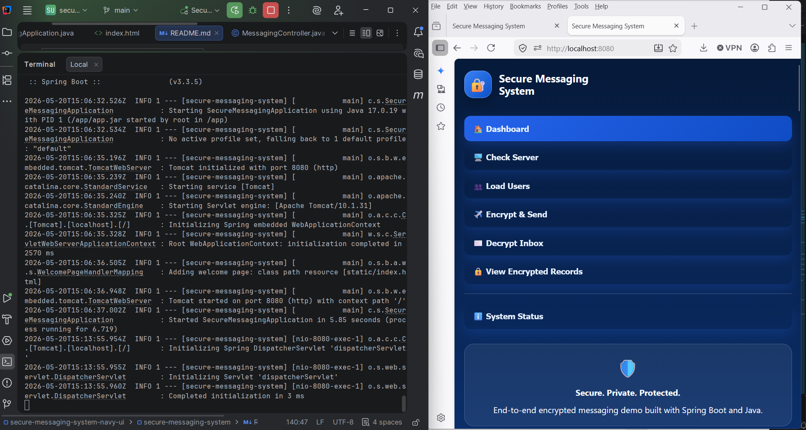

Illustrates successful local execution of the application using Docker containers during development and testing.

#### Render Cloud Deployment

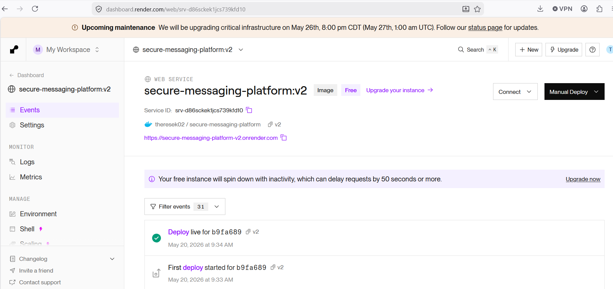

Shows an earlier cloud-hosted deployment stage used during platform development before migration to AWS EC2.

#### Server Status Response

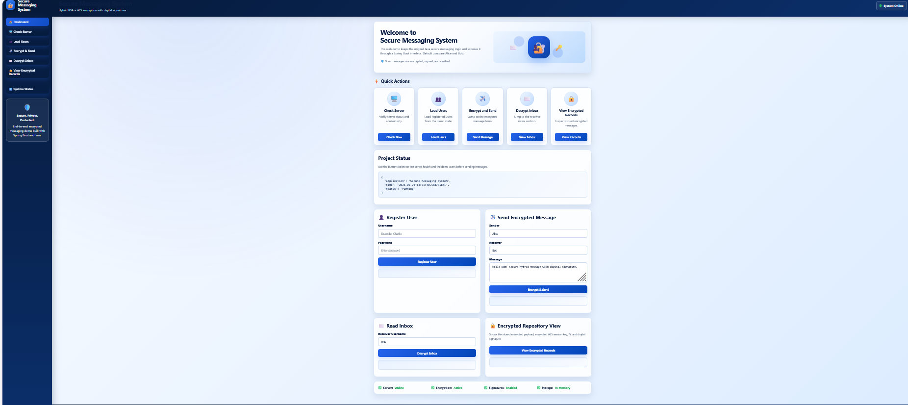

Confirms successful backend operation through a health or status endpoint response.

#### Docker Hub Repository

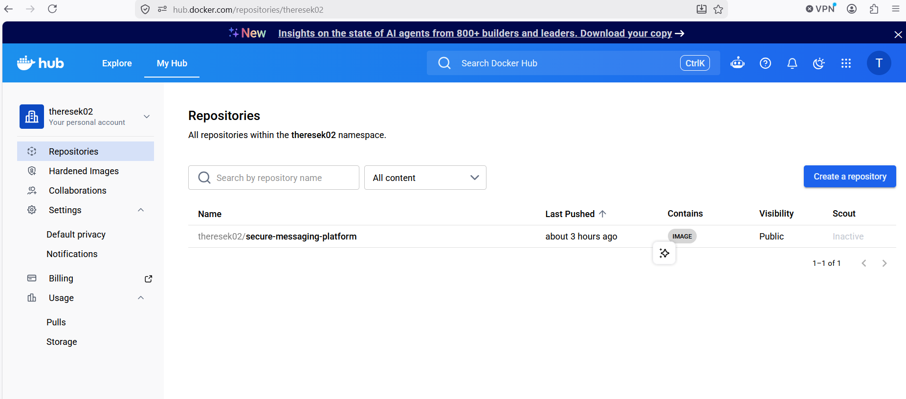

Displays the Docker image repository used to store and manage application container images.

#### Docker Containers Running

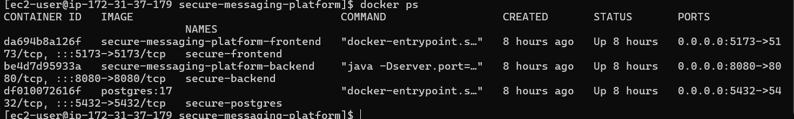

Demonstrates successful execution of the platform services within running Docker containers.

#### Production HTTPS Domain

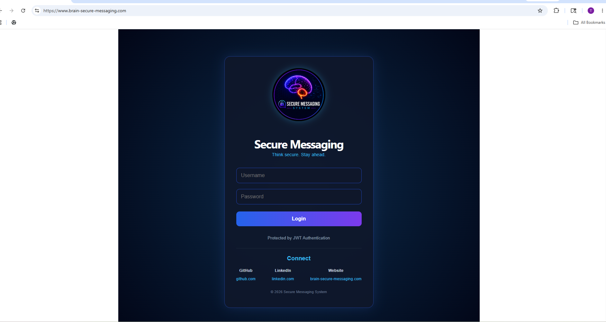

Shows the production environment being served through HTTPS, demonstrating secure web communication.

#### AWS EC2 Deployment

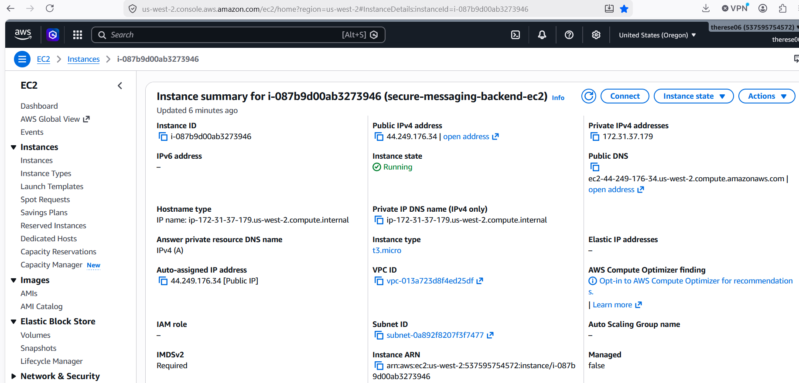

Illustrates the application deployed and managed within the AWS EC2 cloud infrastructure.

---


## Monitoring and Logging


Monitoring and logging play an important role in maintaining application reliability, diagnosing issues, and verifying system behavior during development and production deployments.


### Backend Logging


The Spring Boot backend generates detailed runtime logs that provide visibility into application activity, authentication events, database operations, and API requests. These logs assist in identifying issues and validating system functionality.


### Hibernate SQL Monitoring


Hibernate SQL logging was enabled during development and testing to monitor database interactions. This capability allows developers to inspect generated SQL queries, verify database transactions, and troubleshoot persistence-related issues.


### Docker Log Management


Application logs can be accessed through Docker, providing centralized visibility into container activity. Docker logging simplifies monitoring and debugging of deployed services.


### Production Troubleshooting


Backend logs were extensively used throughout deployment and testing phases to:


- Verify successful API requests

- Monitor database connectivity

- Validate group messaging operations

- Troubleshoot authentication issues

- Confirm container health and application startup


### Observability Benefits


The logging infrastructure provides several operational benefits:


- Faster issue identification

- Improved debugging capabilities

- Enhanced deployment verification

- Better visibility into database operations

- Simplified maintenance and monitoring


### Monitoring Workflow


1\. Deploy application services.

2\. Monitor container status.

3\. Review backend runtime logs.

4\. Analyze Hibernate SQL queries.

5\. Identify and resolve issues.

6\. Validate application functionality.


### Monitoring and Logging Screenshot


#### Backend Monitoring and Logs

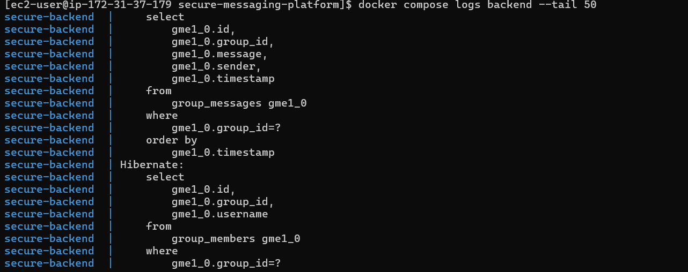

The screenshot demonstrates backend runtime monitoring through Hibernate SQL logs, showing successful database queries related to group messaging functionality and confirming communication between the Spring Boot application and the PostgreSQL database.

---


## CI/CD Pipeline

The Secure Messaging Platform uses GitHub Actions to automate deployment from the `main` branch to the AWS EC2 production environment. The current workflow focuses on controlled continuous deployment after changes have been developed, reviewed, and committed locally.

### GitHub Actions Automation

A push to `main` triggers the `Deploy to EC2` workflow.

The workflow uses the `appleboy/ssh-action` GitHub Action with protected repository secrets for:

- EC2 host resolution
- EC2 SSH username
- EC2 private-key authentication

The remote script uses `set -e`, causing deployment to stop immediately when a command fails.

### Source Synchronization

The EC2 repository is synchronized by fetching `origin`, checking out `main`, and resetting the working tree to `origin/main`. This ensures that the deployed source exactly matches the latest remote commit and does not depend on uncommitted EC2 changes.

### Container Deployment

The deployment workflow:

- Rebuilds the backend and frontend images without using cached build layers
- Force-recreates the application containers through Docker Compose
- Preserves the PostgreSQL data volume
- Prints the Docker Compose service status
- Prints the deployed Git commit for verification

The corrected workflow does not run destructive deployment commands that remove the PostgreSQL volume or prune all Docker images.

### SSH Access Control

GitHub-hosted runners do not use a fixed project-specific IP address. For the current deployment procedure, EC2 SSH port 22 is temporarily opened for the GitHub-hosted runner immediately before pushing to `main`.

The temporary rule remains in place while the workflow is queued or running. After the workflow succeeds and the deployed containers and Git commit are verified, port 22 is returned to the administrator's `My IP` rule.

### Deployment Verification

The corrected EC2 deployment workflow was successfully verified beginning with commit `c09fbc0 Fix EC2 deployment workflow`.

Deployment verification includes:

- Confirming the workflow completed successfully
- Confirming the EC2 repository matches `origin/main`
- Confirming the backend, frontend, and PostgreSQL services are running
- Confirming the production application and health endpoint remain available

### CI/CD Technologies

- GitHub Actions
- GitHub Repository Management
- SSH
- Docker
- Docker Compose
- AWS EC2
- Nginx

### CI/CD Pipeline Screenshot

#### GitHub Actions CI/CD Pipeline

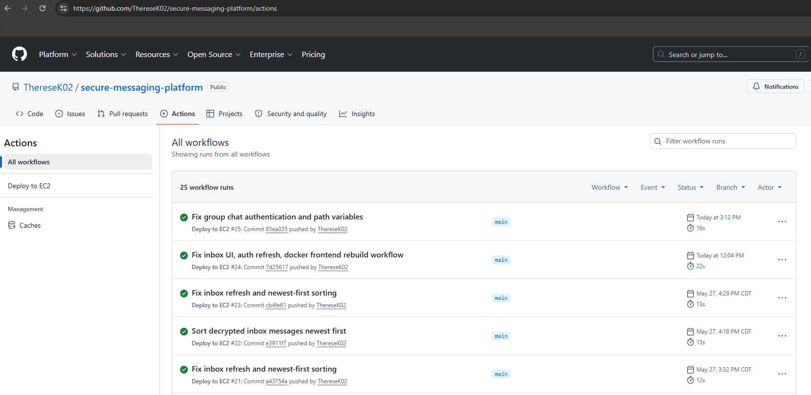

The screenshot shows the GitHub Actions workflow used to synchronize the EC2 repository, rebuild the application images, recreate the containers, and verify the deployed services and Git commit.

---

## Diagrams


### System Design


#### System Architecture Diagram


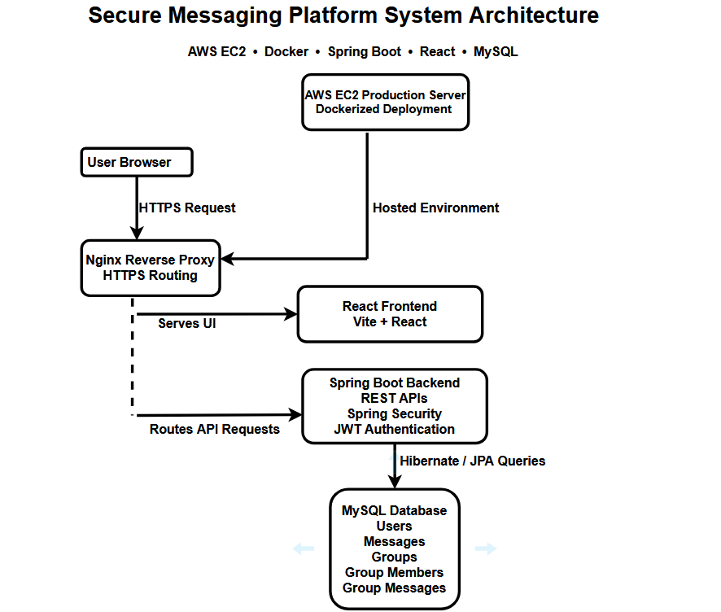


Illustrates the interaction between the React frontend, Spring Boot backend, PostgreSQL database, and supporting infrastructure services.


---


### Deployment Architecture


#### Production Deployment Architecture


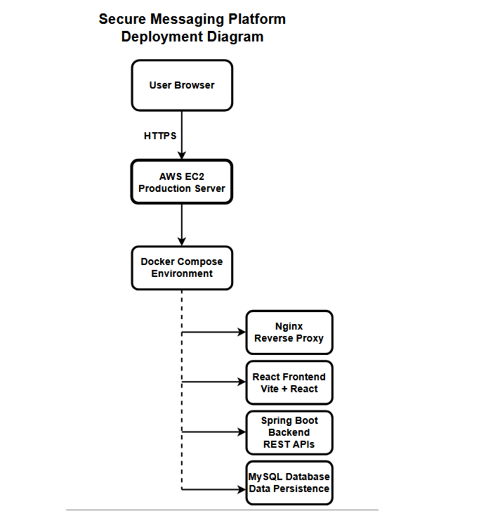


Demonstrates the production deployment environment hosted on AWS EC2 using Docker Compose, including Nginx, React Frontend, Spring Boot Backend, and PostgreSQL Database services.


---


### UML Design


#### Design Class Diagram


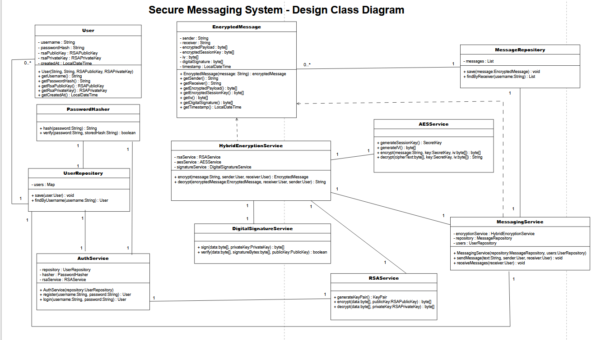


Demonstrates the original object-oriented design of the Secure Messaging System and showcases UML modeling and software design principles.


---


## Key Contributions


Throughout this project, I was responsible for the complete software development lifecycle, including system design, backend development, frontend development, cloud deployment, security implementation, and DevOps (Development and Operations) automation.


### Backend Development


- Designed and implemented RESTful APIs (Representational State Transfer Application Programming Interfaces) using Spring Boot.

- Integrated Spring Security and JWT (JSON Web Token) authentication.

- Developed private messaging and group messaging functionality.

- Configured Hibernate and JPA (Java Persistence API) for database persistence.

- Designed database entities, repositories, services, and controller layers.

- Implemented secure communication workflows between frontend and backend services.


### Frontend Development


- Built a responsive user interface using React and Vite.

- Developed authentication, messaging, inbox, and group chat pages.

- Integrated frontend components with backend REST APIs.

- Improved user experience through intuitive navigation and communication workflows.

- Implemented secure token-based authentication handling within the frontend application.


### Security Implementation


- Implemented JWT (JSON Web Token) authentication and authorization.

- Secured passwords using BCrypt hashing, a password-hashing algorithm designed to protect credentials from brute-force attacks.

- Protected REST endpoints using Spring Security.

- Configured HTTPS (Hypertext Transfer Protocol Secure) for encrypted communication.

- Implemented secure backend validation and access-control mechanisms.


### Cloud and DevOps


- Containerized the application using Docker.

- Managed multi-container deployments using Docker Compose.

- Deployed the platform to AWS EC2 (Amazon Web Services Elastic Compute Cloud).

- Configured Nginx reverse proxy services for traffic routing and application access.

- Implemented CI/CD (Continuous Integration and Continuous Deployment) automation using GitHub Actions.

- Managed production deployment, monitoring, logging, and troubleshooting workflows.


---


## Future Improvements


Several enhancements can be implemented to further improve the platform's functionality, scalability, security, and user experience.


### Planned Features

#### Group Conversation Awareness

The current platform already includes group unread-count badges, group-scoped typing indicators, online and offline member indicators, and automatic presence timeout handling.

Future refinements may include:

- Persisted or distributed presence storage
- Presence synchronization across multiple backend instances
- More detailed availability states
- Optional user-controlled presence preferences

#### Governance Audit Administration

The platform now includes persisted append-only governance events and individual decision acknowledgments across Owner Review, Member Vote, and Owner Led workflows.

Potential future administrative capabilities include:

- Configurable acknowledgment requirements for selected members, roles, or all eligible members
- Decision supersession and archival workflows
- Authorized governance audit views with role-based access controls
- Aggregate governance analytics that do not expose individual secret-ballot choices
- Authorized export and administrative-review tools
- Retention and archival policies for long-term governance records

#### Password and Authentication Management

The current platform already includes a 15-character minimum password policy, a 72-byte BCrypt limit, local and context-specific password screening, compromised-password checking, authenticated Change Password, current-password verification, generic login-failure responses, expired-session handling, and in-memory login throttling.

Remaining improvements include:

- Secure Forgot Password and reset-token workflows
- Token revocation after password reset or important account changes
- Distributed and persistent login throttling across multiple backend instances
- Multi-Factor Authentication (MFA)
- Backup recovery codes
- Passkey enrollment and sign-in
- Active-session and trusted-device management
- Refresh-token rotation and secure session revocation
- Security notifications for important account activity

#### Messaging and Notification Improvements

- Message delivery confirmation beyond the existing read and seen-status features
- Push notifications for new direct and group messages
- Optional notification preferences and sound controls
- Richer real-time collaboration events

#### AI-Powered Intelligence

Future AI-assisted capabilities may improve information discovery, conversation understanding, and organizational productivity while preserving the platform's security and authorization boundaries.

Potential capabilities include:

- **AI Message Summarization:** Allow users to summarize long direct-message conversations, group discussions, and decision-related activity. For example, a user could select **Summarize Conversation** to generate concise key points from hundreds of messages.
- **AI Search:** Support semantic and natural-language search across messages, attachments, and governance records that the authenticated user is authorized to access. This capability may use embeddings, vector search, and Retrieval-Augmented Generation to locate relevant discussions and produce grounded answers.
- **AI Assistant:** Help users draft professional responses, generate meeting notes, summarize conversation context, identify unresolved questions, and suggest next actions without independently taking privileged actions.
- **Smart Classification:** Automatically categorize authorized messages and attachments by topics such as Security, Deployment, Database, Urgent, or General, and identify action items, decisions, tasks, deadlines, and follow-up requests.
- **Decision Discussion Summarization:** Summarize key arguments, unresolved concerns, and discussion outcomes associated with governance decisions.
- **Action-Item Extraction:** Identify potential tasks, deadlines, responsibilities, and follow-up requests from authorized conversations.
- **Conversation Topic Detection:** Organize long group histories into meaningful topics without changing the original message records.
- **Secure Retrieval-Augmented Generation:** Ground AI responses only in records the requesting user is permitted to access.
- **AI Auditability and Transparency:** Clearly identify AI-generated summaries, preserve links to supporting messages, and allow users to verify generated conclusions.
- **Privacy-Preserving AI Controls:** Prevent AI features from exposing private messages, secret-ballot choices, restricted attachments, or unauthorized governance information.

These capabilities would demonstrate practical experience with LLM integration, prompt engineering, semantic search, embeddings, vector databases, Retrieval-Augmented Generation, natural-language processing, machine learning, backend API design, and AI-assisted workflow development.

AI-generated content should remain advisory. It must not silently modify messages, cast votes, resolve decisions, expose individual secret ballots, or perform owner- or administrator-only actions.

#### User Experience Improvements

- User profile management
- Richer file and image previews
- File type validation
- Larger attachment workflows
- Improved attachment management

### Scalability Improvements


- Redis (Remote Dictionary Server) caching integration to improve performance and reduce database load.

- Load balancing for multiple application instances.

- Kubernetes (K8s) container orchestration for automated deployment, scaling, and management of containerized applications.

- Cloud-native monitoring solutions.

- Migration toward a microservices architecture.


### Security Enhancements


- Role-Based Access Control (RBAC) for granular permission management.

- Advanced audit logging.

- Enhanced security monitoring and session management.

- Key rotation and forward secrecy implementation.

---


## Learning Outcomes


This project provided valuable experience across multiple areas of software engineering, cybersecurity, cloud computing, and DevOps practices.


### Software Engineering


- Applied object-oriented design principles.

- Developed scalable backend architectures.

- Built modern frontend applications using React.

- Implemented RESTful API (Representational State Transfer Application Programming Interface) design practices.

- Improved software maintainability through modular application design.


### Security


- Learned JWT (JSON Web Token) authentication workflows.

- Implemented Spring Security authorization mechanisms.

- Applied secure password management using BCrypt hashing.

- Configured HTTPS (Hypertext Transfer Protocol Secure) deployments.

- Improved understanding of authentication and authorization best practices.


### Cloud Computing and DevOps


- Gained hands-on experience with Docker containerization.

- Managed multi-container applications using Docker Compose.

- Deployed applications to AWS EC2 (Amazon Web Services Elastic Compute Cloud).

- Configured Nginx reverse proxy services.

- Built CI/CD (Continuous Integration and Continuous Deployment) pipelines using GitHub Actions.

- Troubleshot production deployment issues and cloud infrastructure configurations.


### Database Management


- After designing relational database structures, I implemented persistence using Hibernate and JPA (Java Persistence API).

- Applied ORM (Object-Relational Mapping) concepts to connect Java objects with relational database tables.

- Gained more practical experience in managing data retrieval, storage, and database interactions.


### Full-Stack Development


- Integrated frontend and backend systems.

- Managed application deployment from development to production.

- Troubleshot deployment, networking, and infrastructure issues.

- Improved application maintainability, scalability, and security.

- Gained practical experience building and deploying a production-oriented full-stack application.


---


## Final Conclusion


The Secure Messaging Platform demonstrates the successful development and deployment of a modern full-stack communication application. The project combines secure authentication, private messaging, group messaging, database persistence, cloud deployment, containerization, and DevOps automation within a single production-oriented system.


Through this project, I applied software engineering best practices across backend development, frontend development, cybersecurity, database management, cloud infrastructure, and CI/CD (Continuous Integration and Continuous Deployment) workflows. The result is a scalable and maintainable platform that showcases practical experience with modern enterprise development technologies, including Spring Boot, React, Docker, AWS EC2 (Amazon Web Services Elastic Compute Cloud), Nginx, GitHub Actions, Hibernate, and JWT (JSON Web Token) authentication.


This project represents an important milestone in my journey as a Software Engineer and demonstrates my ability to design, build, secure, deploy, and maintain full-stack applications within modern cloud environments.


---

## Author

**Therese Kabayanja**

Software Engineer | Machine Learning Engineer | Data Scientist

- GitHub: [ThereseK02](https://github.com/ThereseK02)
- LinkedIn: [Therese Kabayanja](https://www.linkedin.com/in/therese-kabayanja-14a43739b)
- Production Website: [brain-secure-messaging.com](https://brain-secure-messaging.com)
