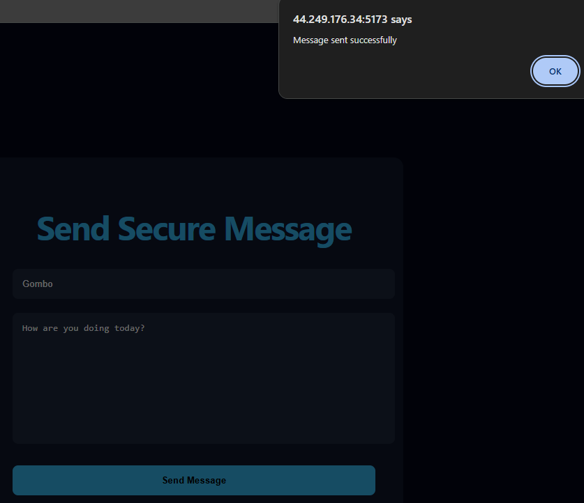
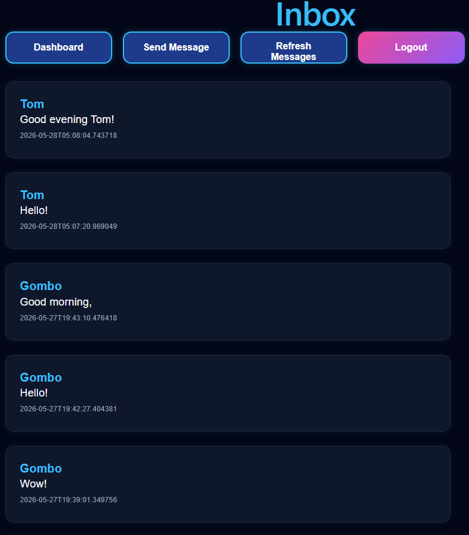
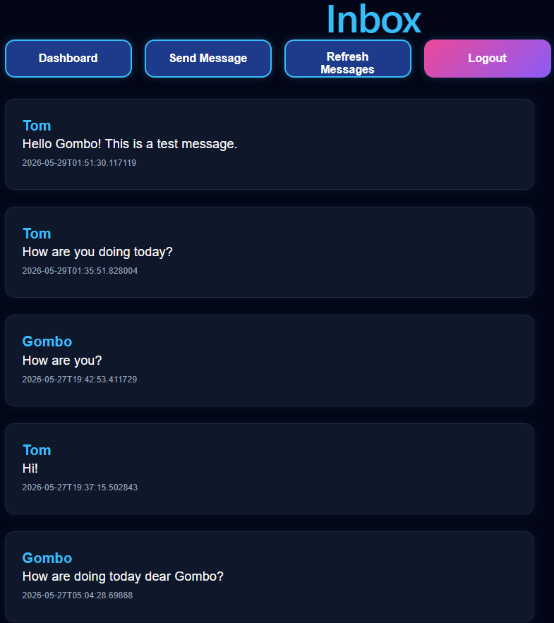
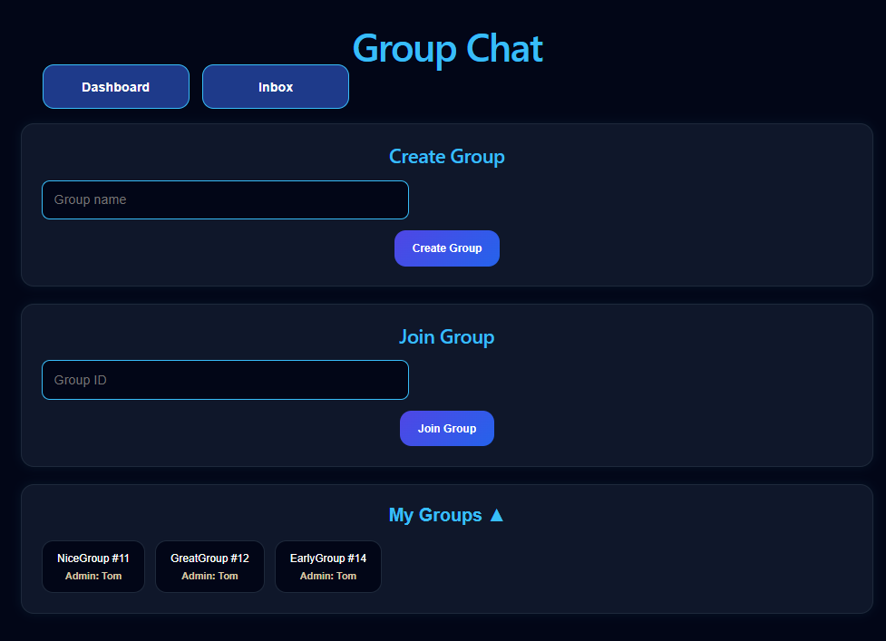
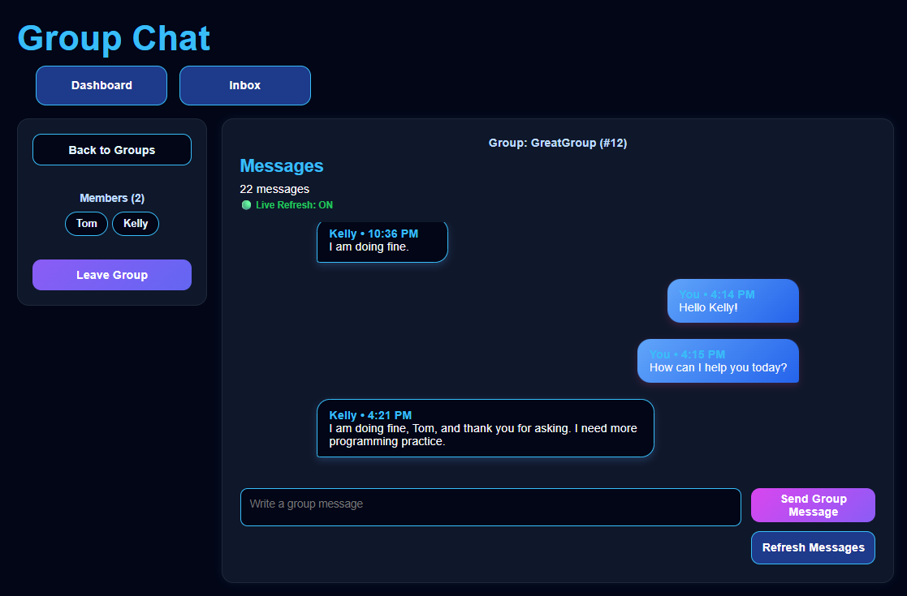

# Secure Messaging Platform


## Project Overview


The Secure Messaging Platform is a full-stack cloud-deployed communication application that enables secure user authentication, private messaging, and group messaging through a modern web interface.


I designed and developed the platform using Spring Boot for the backend and React for the frontend. The system implements JWT-based authentication, secure password storage, protected REST APIs, containerized deployment using Docker, and cloud hosting on AWS EC2.


The platform demonstrates full-stack software engineering, cloud deployment, DevOps automation, database management, authentication, authorization, and secure communication workflows.


---


## Table of Contents


- [Project Overview](#project-overview)

- [Table of Contents](#table-of-contents)

- [Key Features](#key-features)

- [System Architecture](#system-architecture)

- [Technology Stack](#technology-stack)

- [Project Structure](#project-structure)

- [Database Design](#database-design)

- [Security Features](#security-features)

- [Encryption Features](#encryption-features)

- [Welcome Page](#welcome-page)

- [Authentication Workflow](#authentication-workflow)

- [Messaging Features](#messaging-features)

- [Group Messaging](#group-messaging)

- [Deployment Architecture](#deployment-architecture)

- [Monitoring and Logging](#monitoring-and-logging)

- [CI/CD Pipeline](#cicd-pipeline)

- [Diagrams](#diagrams)

- [Key Contributions](#key-contributions)

- [Future Improvements](#future-improvements)

- [Learning Outcomes](#learning-outcomes)

- [Final Conclusion](#final-conclusion)

- [Author](#author)

---


## Key Features


- User registration and login

- JSON Web Token (JWT)-based authentication and authorization

- Secure password storage with BCrypt

- Private messaging between users

- Group messaging functionality

- PostgreSQL database persistence

- Spring Security integration

- RESTful API architecture

- Docker containerization

- AWS EC2 deployment

- Nginx reverse proxy configuration

- HTTPS/SSL support

- GitHub Actions CI/CD automation

- Monitoring and backend logging


---


## System Architecture


The Secure Messaging Platform follows a modern three-tier architecture consisting of a React frontend, a Spring Boot backend, and a PostgreSQL database.

The frontend provides the user interface for authentication, private messaging, and group communication. Incoming user requests are routed through Nginx and forwarded to the appropriate application components. Spring Security and JWT authentication protect secured endpoints, while Hibernate/JPA manages database persistence and data access operations.

The Secure Messaging Platform is deployed on an AWS EC2 production server using Docker Compose. Incoming HTTPS requests are handled by Nginx, which serves the React frontend and routes API requests to the Spring Boot backend. The backend exposes REST APIs, enforces authentication and authorization through Spring Security and JWT tokens, and persists application data in a PostgreSQL database.

This architecture provides a clear separation of concerns between the presentation layer (React), application layer (Spring Boot), and data layer (PostgreSQL), resulting in a scalable, maintainable, and production-ready full-stack application.

---

## Technology Stack


### Backend


- Java 17

- Spring Boot

- Spring Security

- Hibernate / JPA

- JWT Authentication

- Maven


### Frontend


- React

- Vite

- React Router
  
- Axios

- JavaScript

- HTML5

- CSS3


### Database


- PostgreSQL


### DevOps & Cloud


- Docker

- Docker Compose

- AWS EC2

- Nginx

- GitHub Actions

- HTTPS / SSL


---


## Project Structure


```text
secure-messaging-platform/
├─ secure-messaging-backend/
├─ secure-messaging-frontend/
├─ screenshots/
├─ diagrams/
├─ docker-compose.yml
└─ README.md
```

---


## Database Design

### Database Design Diagram


Illustrates the relational database structure used by the platform, including users, messages, groups, group memberships, and group messages.


---


## Security Features


The Secure Messaging Platform implements multiple layers of security to protect user accounts, application resources, and communication workflows.


### JSON Web Token (JWT) Authentication


- Authenticates users after successful login

- Issues a JWT token for protected requests

- Requires valid tokens for secured API access

- Prevents unauthorized users from accessing private messaging features


### Spring Security


- Protects backend REST endpoints

- Separates public routes from protected routes

- Allows public access to registration and login

- Requires authentication for messaging, dashboard, and group communication features


### Password Protection


- Hashes passwords using BCrypt

- Avoids storing plain-text passwords

- Improves credential security in the database


### Protected REST APIs


- Validates authentication before processing sensitive requests

- Rejects unauthorized API calls

- Protects user messages, inbox data, and group messaging endpoints


### Secure Deployment


- Uses Nginx as a reverse proxy

- Supports HTTPS/SSL in production

- Runs services inside Docker containers

- Deploys the application on AWS EC2


---

## Encryption Features

The Secure Messaging Platform includes encryption-focused features that demonstrate secure communication workflows and protected message storage.

### Encrypted Message Transmission

Messages can be encrypted before being transmitted between users, helping protect message content during communication.

### Encrypted Storage Concepts

Encrypted message handling was explored during development to demonstrate how sensitive communication data can be protected within application workflows.

### Encryption Workflow

1. User composes a message.
2. Message content is encrypted.
3. Encrypted data is transmitted or stored.
4. Authorized users retrieve the message.
5. Message content is decrypted for viewing.

### Encryption Screenshots

#### Encrypted Send Message


Demonstrates message encryption before transmission, illustrating how message content can be protected prior to delivery.

#### Decrypted Inbox View


Shows successful message decryption within the inbox interface, allowing authorized users to view protected message content.

#### Encrypted Repository View


Illustrates encrypted message persistence and storage concepts explored during development to support secure communication workflows.

---
## Welcome Page

The Secure Messaging Platform begins with a dedicated Welcome Page that serves as the public entry point to the application. The landing experience introduces the platform, highlights key features, and provides convenient access to registration and login workflows.

### Welcome Screen


The Welcome Page presents the Secure Messaging Platform branding, project overview, feature highlights, and navigation options that guide users into the secure messaging environment. This enhancement improves usability, strengthens application branding, and creates a more professional user experience before authentication.

---


## Authentication Workflow


The authentication workflow controls how users register, log in, and access protected features inside the Secure Messaging Platform.


### Registration


- A new user creates an account through the registration page.

- The backend receives the registration request through a REST API endpoint.

- The password is hashed using BCrypt before being stored.

- User information is persisted in the PostgreSQL database.


### Login


- A registered user logs in with valid credentials.

- The backend verifies the submitted password against the stored BCrypt hash.

- If authentication succeeds, the backend generates a JWT token.

- The frontend stores the token and uses it for future protected API requests.


### Protected Access


- The user can access secured pages such as the dashboard, private messaging, inbox, and group messaging.

- Each protected request includes the JWT token.

- Spring Security validates the token before allowing access to backend resources.


### Authentication Screenshots

#### Register Page


Displays the user registration interface used to create new platform accounts.

#### Login Page


Shows the secure login interface where users authenticate using their registered credentials.

#### JWT Authenticated Dashboard


Illustrates successful JWT-based authentication and access to protected application functionality.

#### Dashboard Overview


Displays an earlier authenticated dashboard implementation used during development, highlighting navigation options and the evolution of the user interface prior to the final production design.

---


## Messaging Features


The Secure Messaging Platform enables authenticated users to exchange private messages through a secure and user-friendly interface.


### Secure Message Delivery


Users can compose and send private messages to other registered users through the messaging interface. Messages are transmitted through protected REST API endpoints secured with JWT authentication.


### Inbox Management


Incoming messages are displayed in the user's inbox, allowing users to review received communications in a centralized location. The inbox provides a simple and organized view of message history.


### Conversation Tracking


The platform maintains message records within the database, enabling users to view ongoing conversations and communication history between participants.


### Database Persistence


Messages are stored in PostgreSQL using Hibernate/JPA, ensuring reliable data persistence and retrieval. This approach allows message history to remain available across application restarts and deployments.


### Private Messaging Workflow


The messaging interface was designed to provide a straightforward communication workflow:


1\. Select a recipient.

2\. Compose a message.

3\. Send the message.

4\. View received messages in the inbox.

5\. Review conversation history.

### Private Messaging Screenshots

#### Send Secure Message



Displays the interface used to compose and securely send messages to other authenticated users.

#### Decrypted Inbox Messages



Shows received messages displayed within the inbox after successful retrieval and processing.

#### Message Exchange



Demonstrates communication between users through the secure messaging workflow.

---

## Group Messaging

The Secure Messaging Platform includes a production-ready group messaging workflow that allows authenticated users to create groups, join existing groups, view members, and participate in shared conversations through a chat-style interface.

### Group Creation and Joining

Authenticated users can create new groups by entering a group name. Each group receives a unique identifier that other users can use to join the conversation.

Users can also join existing groups by entering a group ID. Once joined, the group appears under the user's **My Groups** section.

### Group Membership Display

The group chat interface displays current group members using compact member badges. Group creators are identified with an administrator badge, making ownership and membership easier to understand.

### Group Conversation Experience

The group conversation page uses a two-page workflow:

1. Page 1 displays Create Group, Join Group, and My Groups.
2. Page 2 displays the selected group conversation.
3. Users can return to Page 1 with the Back to Groups button.
4. Users can leave a group from the conversation view.

Messages are shown in a chat-style layout with sender labels and timestamps. The current user's messages are labeled as **You**, while messages from other participants show the sender's username.

### Live Refresh

Group messages refresh automatically every three seconds using polling. This allows participants to see new messages without manually refreshing the page.

The current implementation uses polling for reliable real-time-style behavior. A future version may migrate this feature to WebSockets for true real-time messaging.

### Responsive Layout

The Group Chat interface was refined for laptop and monitor screens. The layout keeps the message input and action buttons visible, uses internal scrolling for the message area, and maintains a compact header and member display.

### Database Management

Group records, group memberships, and group messages are stored using Hibernate/JPA and PostgreSQL. This supports persistent conversations, reliable member tracking, and future scalability.

### Group Messaging Screenshots

#### Group Chat Overview



Displays the group management page where users can create groups, join groups, and open existing group conversations.

#### Group Conversation



Shows the group conversation interface with sender labels, timestamps, message history, live refresh, member display, and visible message controls.


---


## Deployment Architecture


The Secure Messaging Platform was designed using a containerized deployment architecture that supports local development, cloud hosting, automated deployments, and production scalability.


### Containerized Infrastructure


The application is packaged and deployed using Docker containers. Containerization provides a consistent runtime environment across development, testing, and production systems while simplifying deployment and maintenance.


### Docker Compose Orchestration


Docker Compose is used to manage and coordinate the application's services, including the Spring Boot backend and supporting infrastructure. This approach simplifies multi-service deployment and environment management.


### Cloud Deployment


The platform evolved through multiple deployment stages, beginning with local Docker deployments and cloud-hosted environments before reaching a production-ready AWS EC2 deployment.


### AWS EC2 Hosting


The production environment is hosted on AWS EC2, providing a reliable cloud infrastructure capable of supporting secure communication services. EC2 enables full control over deployment configuration, networking, and application management.


### Nginx Reverse Proxy


Nginx serves as a reverse proxy between users and the backend services. Incoming requests are routed through Nginx, which forwards traffic to the appropriate application services while improving security and request handling.


### HTTPS and Domain Configuration


The platform supports HTTPS-secured communication, ensuring that data exchanged between users and the application is encrypted during transmission. HTTPS configuration improves security and aligns with modern web deployment standards.


### Deployment Workflow


1\. Develop and test features locally.

2\. Build Docker images.

3\. Push application updates to GitHub.

4\. Trigger the CI/CD pipeline.

5\. Deploy updated containers to AWS EC2.

6\. Route traffic through Nginx.

7\. Serve the application over HTTPS.


### Deployment Screenshots

#### Docker Local Deployment


Illustrates successful local execution of the application using Docker containers during development and testing.

#### Render Cloud Deployment


Shows an earlier cloud-hosted deployment stage used during platform development before migration to AWS EC2.

#### Server Status Response


Confirms successful backend operation through a health or status endpoint response.

#### Docker Hub Repository


Displays the Docker image repository used to store and manage application container images.

#### Docker Containers Running


Demonstrates successful execution of the platform services within running Docker containers.

#### Production HTTPS Domain


Shows the production environment being served through HTTPS, demonstrating secure web communication.

#### AWS EC2 Deployment


Illustrates the application deployed and managed within the AWS EC2 cloud infrastructure.

---


## Monitoring and Logging


Monitoring and logging play an important role in maintaining application reliability, diagnosing issues, and verifying system behavior during development and production deployments.


### Backend Logging


The Spring Boot backend generates detailed runtime logs that provide visibility into application activity, authentication events, database operations, and API requests. These logs assist in identifying issues and validating system functionality.


### Hibernate SQL Monitoring


Hibernate SQL logging was enabled during development and testing to monitor database interactions. This capability allows developers to inspect generated SQL queries, verify database transactions, and troubleshoot persistence-related issues.


### Docker Log Management


Application logs can be accessed through Docker, providing centralized visibility into container activity. Docker logging simplifies monitoring and debugging of deployed services.


### Production Troubleshooting


Backend logs were extensively used throughout deployment and testing phases to:


- Verify successful API requests

- Monitor database connectivity

- Validate group messaging operations

- Troubleshoot authentication issues

- Confirm container health and application startup


### Observability Benefits


The logging infrastructure provides several operational benefits:


- Faster issue identification

- Improved debugging capabilities

- Enhanced deployment verification

- Better visibility into database operations

- Simplified maintenance and monitoring


### Monitoring Workflow


1\. Deploy application services.

2\. Monitor container status.

3\. Review backend runtime logs.

4\. Analyze Hibernate SQL queries.

5\. Identify and resolve issues.

6\. Validate application functionality.


### Monitoring and Logging Screenshot


#### Backend Monitoring and Logs


The screenshot demonstrates backend runtime monitoring through Hibernate SQL logs, showing successful database queries related to group messaging functionality and confirming communication between the Spring Boot application and the PostgreSQL database.

---

## CI/CD Pipeline


The Secure Messaging Platform incorporates a Continuous Integration and Continuous Deployment (CI/CD) workflow to automate the build, testing, and deployment process. This approach improves development efficiency, reduces manual deployment tasks, and ensures consistent application delivery.


### GitHub Actions Automation


GitHub Actions is used to automate deployment workflows whenever code changes are pushed to the repository. The pipeline provides a reliable mechanism for building and deploying application updates.


### Continuous Integration


The CI process automatically validates project updates by:


- Pulling the latest source code from GitHub

- Building the application components

- Verifying project configuration

- Preparing deployment artifacts


This helps identify issues early in the development lifecycle and improves code quality.


### Continuous Deployment


After successful validation, the deployment workflow can automatically update the target environment, reducing the need for manual deployment procedures.


### DevOps Benefits


Implementing CI/CD provides several advantages:


- Faster software delivery

- Reduced deployment errors

- Consistent deployment procedures

- Improved development productivity

- Better collaboration through version control automation


### Deployment Workflow


1\. Developer pushes code changes to GitHub.

2\. GitHub Actions automatically triggers the workflow.

3\. Application components are built and validated.

4\. Deployment artifacts are generated.

5\. Updated services are deployed to the target environment.

6\. The application becomes available to users.


### CI/CD Technologies


- GitHub Actions

- GitHub Repository Management

- Docker

- Docker Compose

- AWS EC2

- Nginx


### CI/CD Pipeline Screenshot

#### GitHub Actions CI/CD Pipeline


The GitHub Actions workflow demonstrates the automated deployment pipeline used to build, validate, and deploy application updates, supporting a modern DevOps-oriented software development process.

---


## Diagrams


### System Design


#### System Architecture Diagram


Illustrates the interaction between the React frontend, Spring Boot backend, PostgreSQL database, and supporting infrastructure services.


---


### Deployment Architecture


#### Production Deployment Architecture


Demonstrates the production deployment environment hosted on AWS EC2 using Docker Compose, including Nginx, React Frontend, Spring Boot Backend, and PostgreSQL Database services.


---


### UML Design


#### Design Class Diagram


Demonstrates the original object-oriented design of the Secure Messaging System and showcases UML modeling and software design principles.


---


## Key Contributions


Throughout this project, I was responsible for the complete software development lifecycle, including system design, backend development, frontend development, cloud deployment, security implementation, and DevOps (Development and Operations) automation.


### Backend Development


- Designed and implemented RESTful APIs (Representational State Transfer Application Programming Interfaces) using Spring Boot.

- Integrated Spring Security and JWT (JSON Web Token) authentication.

- Developed private messaging and group messaging functionality.

- Configured Hibernate and JPA (Java Persistence API) for database persistence.

- Designed database entities, repositories, services, and controller layers.

- Implemented secure communication workflows between frontend and backend services.


### Frontend Development


- Built a responsive user interface using React and Vite.

- Developed authentication, messaging, inbox, and group chat pages.

- Integrated frontend components with backend REST APIs.

- Improved user experience through intuitive navigation and communication workflows.

- Implemented secure token-based authentication handling within the frontend application.


### Security Implementation


- Implemented JWT (JSON Web Token) authentication and authorization.

- Secured passwords using BCrypt hashing, a password-hashing algorithm designed to protect credentials from brute-force attacks.

- Protected REST endpoints using Spring Security.

- Configured HTTPS (Hypertext Transfer Protocol Secure) for encrypted communication.

- Implemented secure backend validation and access-control mechanisms.


### Cloud and DevOps


- Containerized the application using Docker.

- Managed multi-container deployments using Docker Compose.

- Deployed the platform to AWS EC2 (Amazon Web Services Elastic Compute Cloud).

- Configured Nginx reverse proxy services for traffic routing and application access.

- Implemented CI/CD (Continuous Integration and Continuous Deployment) automation using GitHub Actions.

- Managed production deployment, monitoring, logging, and troubleshooting workflows.


---


## Future Improvements


Several enhancements can be implemented to further improve the platform's functionality, scalability, security, and user experience.


### Planned Features


- Real-time messaging using WebSockets, a communication protocol that enables persistent bidirectional communication between clients and servers.

- Message delivery and read receipts.

- User profile management.

- File and image sharing.

- Push notification system.

- Message search functionality.

- Group administration controls.

- Message editing and deletion.


### Scalability Improvements


- Redis (Remote Dictionary Server) caching integration to improve performance and reduce database load.

- Load balancing for multiple application instances.

- Kubernetes (K8s) container orchestration for automated deployment, scaling, and management of containerized applications.

- Cloud-native monitoring solutions.

- Migration toward a microservices architecture.


### Security Enhancements


- Multi-Factor Authentication (MFA) for additional account protection.

- Refresh token support for improved session management.

- Role-Based Access Control (RBAC) for granular permission management.

- Advanced audit logging.

- Enhanced security monitoring and session management.

- Key rotation and forward secrecy implementation.

---


## Learning Outcomes


This project provided valuable experience across multiple areas of software engineering, cybersecurity, cloud computing, and DevOps practices.


### Software Engineering


- Applied object-oriented design principles.

- Developed scalable backend architectures.

- Built modern frontend applications using React.

- Implemented RESTful API (Representational State Transfer Application Programming Interface) design practices.

- Improved software maintainability through modular application design.


### Security


- Learned JWT (JSON Web Token) authentication workflows.

- Implemented Spring Security authorization mechanisms.

- Applied secure password management using BCrypt hashing.

- Configured HTTPS (Hypertext Transfer Protocol Secure) deployments.

- Improved understanding of authentication and authorization best practices.


### Cloud Computing and DevOps


- Gained hands-on experience with Docker containerization.

- Managed multi-container applications using Docker Compose.

- Deployed applications to AWS EC2 (Amazon Web Services Elastic Compute Cloud).

- Configured Nginx reverse proxy services.

- Built CI/CD (Continuous Integration and Continuous Deployment) pipelines using GitHub Actions.

- Troubleshot production deployment issues and cloud infrastructure configurations.


### Database Management


- After designing relational database structures, I implemented persistence using Hibernate and JPA (Java Persistence API).

- Applied ORM (Object-Relational Mapping) concepts to connect Java objects with relational database tables.

- Gained more practical experience in managing data retrieval, storage, and database interactions.


### Full-Stack Development


- Integrated frontend and backend systems.

- Managed application deployment from development to production.

- Troubleshot deployment, networking, and infrastructure issues.

- Improved application maintainability, scalability, and security.

- Gained practical experience building and deploying a production-oriented full-stack application.


---


## Final Conclusion


The Secure Messaging Platform demonstrates the successful development and deployment of a modern full-stack communication application. The project combines secure authentication, private messaging, group messaging, database persistence, cloud deployment, containerization, and DevOps automation within a single production-oriented system.


Through this project, I applied software engineering best practices across backend development, frontend development, cybersecurity, database management, cloud infrastructure, and CI/CD (Continuous Integration and Continuous Deployment) workflows. The result is a scalable and maintainable platform that showcases practical experience with modern enterprise development technologies, including Spring Boot, React, Docker, AWS EC2 (Amazon Web Services Elastic Compute Cloud), Nginx, GitHub Actions, Hibernate, and JWT (JSON Web Token) authentication.


This project represents an important milestone in my journey as a Software Engineer and demonstrates my ability to design, build, secure, deploy, and maintain full-stack applications within modern cloud environments.


---

## Author

**Therese Kabayanja**

Software Engineer | Machine Learning Engineer | Data Scientist

- GitHub: [ThereseK02](https://github.com/ThereseK02)
- LinkedIn: [Therese Kabayanja](https://www.linkedin.com/in/therese-kabayanja-14a43739b)
- Production Website: [brain-secure-messaging.com](https://brain-secure-messaging.com)


